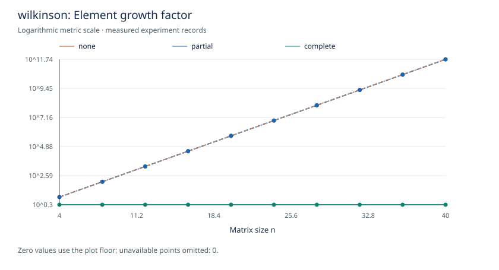
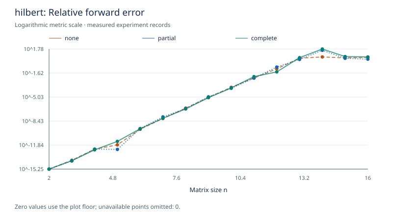
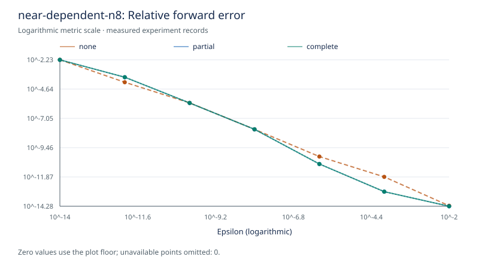

# Pivot Growth Stability Lab

Educational .NET 10 numerical-analysis lab comparing Gaussian elimination with no pivoting, partial pivoting, and complete pivoting.

> Same mathematical problem. Same elimination framework. Different pivot choice. Very different intermediate arithmetic.

One `GaussianEliminationSolver` accepts an `IPivotStrategy`. Every strategy shares matrix storage, elimination, back substitution, diagnostics, fixtures, and reporting. Complete pivoting restores the original variable order, and solving never mutates the input matrix or RHS.

## Quick start

Requires the .NET 10 SDK.

```sh
dotnet restore
dotnet build
dotnet test
dotnet run --project src/PivotGrowth.Cli -- suite --preset smoke
```

Run the canonical Wilkinson experiment or the full README suite:

```sh
dotnet run --project src/PivotGrowth.Cli -c Release -- run --fixture wilkinson --sizes 4:40:4 --pivot none,partial,complete --out artifacts/wilkinson
dotnet run --project src/PivotGrowth.Cli -c Release -- suite --preset readme --out artifacts/readme
```

Each run writes console output, `results.csv`, `results.md`, and SVG charts for growth, residual, forward error, pivot comparisons, and runtime. See [usage and benchmarks](docs/usage.md) for all options, presets, and exit codes.

## What this lab measures

| Question | Measurement |
|---|---|
| Does the returned vector satisfy Ax ≈ b? | Relative residual: ‖Ax−b‖∞ / (‖A‖∞ ‖x‖∞ + ‖b‖∞) |
| Is it close to the known x_true? | Relative forward error: ‖x−x_true‖₂ / ‖x_true‖₂ |
| How large did intermediate coefficients become? | Growth factor: maximum absolute coefficient over all elimination states / original maximum |
| What did pivoting cost? | Comparisons, row/column swaps, explicit arithmetic counters, elapsed time and benchmark allocations |

Tiny pivots are recorded separately from exact-zero pivots. Non-finite input and arithmetic are detected. Full definitions, failure semantics, and counting conventions are in [metrics](docs/metrics.md).

## Results from actual runs

The following snapshot was generated with the README suite, seed 42, .NET SDK 10.0.401 / runtime 10.0.12 on Windows x64. The [complete CSV](docs/results/results.csv) preserves all 108 records. Timing values are single diagnostic measurements and are not benchmark conclusions. Last-bit numerical results can vary across platforms.

| Fixture | n | Pivot | Growth | Relative residual | Relative forward error | Comparisons |
|---|---:|---|---:|---:|---:|---:|
| wilkinson | 40 | none | 5.49756E+11 | 1.74514E-08 | 3.55488E-07 | 0 |
| wilkinson | 40 | partial | 5.49756E+11 | 1.74514E-08 | 3.55488E-07 | 780 |
| wilkinson | 40 | complete | 2 | 2.67363E-18 | 1.65369E-16 | 22100 |
| hilbert | 12 | none | 1 | 6.57833E-17 | 0.0954577 | 0 |
| hilbert | 12 | partial | 1 | 1.24226E-16 | 0.16618 | 66 |
| hilbert | 12 | complete | 1 | 6.89735E-17 | 0.0346837 | 638 |

For Wilkinson at n=40, no and partial pivoting grow by 2³⁹; complete pivoting limits growth to 2 in this fixture.



For Hilbert at n=12, partial pivoting has a residual near machine precision while its relative forward error is about 0.166. Low growth and a small residual do not establish forward accuracy on an ill-conditioned problem.



The near-dependent family changes only epsilon against a fixed base matrix and perturbation direction. Decreasing epsilon can amplify solution error; individual floating-point results need not be monotonic.



Charts use log scales. Exact zeros sit at a display floor and unavailable values are omitted. Regenerate the numerical data and charts with the README suite command above; see [refreshing the documented results](docs/usage.md#refreshing-the-documented-results) to update the saved snapshot.

## Fixtures and reproducibility

- **Wilkinson:** unit diagonal, −1 below it, final column of ones.
- **Hilbert:** a[i,j] = 1/(i+j+1), with x_true equal to ones.
- **Near-dependent:** last row = first row + epsilon × original last row of a fixed seeded diagonally dominant matrix.
- **Diagonally dominant:** seeded off-diagonal entries with diagonal = absolute off-diagonal row sum + 1.
- **Well-conditioned:** symmetric 2I+E with absolute off-diagonal row sums below 1, bounding the spectral condition number below 3.

Every RHS is derived as `b = A*x_true` in binary64. Except for Hilbert, the known solution alternates sign with magnitude 1/(i+1), avoiding an artificially exact all-ones Wilkinson solve. Seeded fixtures use the repository's specified SplitMix64 generator, not `System.Random`. Pivot ties use the first row, then first column. Fixed seed and sizes produce identical fixture data within the specified arithmetic.

## Benchmarks

```sh
dotnet run --project src/PivotGrowth.Benchmarks -c Release -- --filter "*"
```

BenchmarkDotNet measures the three strategies at sizes 64,128,256,512 on a seeded well-conditioned baseline, including allocations. Fixture construction is outside measurement; input cloning and solver diagnostics are inside. A three-strategy size-64 Dry job was executed to validate the harness; no statistical performance claims are made from that run.

## Layout and validation

- `PivotGrowth.Core`: numerical primitives, strategies, shared solver, fixtures and metrics; no runtime packages.
- `PivotGrowth.Cli`: experiment presets, argument parsing, CSV/Markdown/SVG reports.
- `PivotGrowth.Tests`: deterministic xUnit tests for numerical behavior, permutations, growth, counters, reports and CLI.
- `PivotGrowth.Benchmarks`: separate BenchmarkDotNet harness.

```sh
dotnet format --verify-no-changes
dotnet test -c Release
dotnet run --project src/PivotGrowth.Cli -- suite --preset smoke
```

CI runs build, tests, formatting and the smoke suite on Windows and Linux.

## Limitations

This is an educational dense solver, not production linear algebra. It does not implement sparse matrices, inversion, QR/SVD/eigenvalue methods, BLAS, SIMD/GPU acceleration, arbitrary precision, or a UI/API.

Conditioning belongs to the problem; stability belongs to the algorithm; growth diagnoses the elimination path. None alone determines forward error. Tiny pivots do not prove singularity, and a successful status does not promise an accurate solution. Extremely scaled inputs can overflow ordinary binary64 products or residual norms; such failures are reported. The stored RHS itself includes rounding from its generation.

## Documentation

- [Usage, CLI options and validation](docs/usage.md)
- [Architecture and repository layout](docs/architecture.md)
- [Algorithms](docs/algorithms.md)
- [Numerical notes](docs/numerics.md)
- [Metric definitions](docs/metrics.md)
- [Fixtures and experiment presets](docs/experiments.md)
